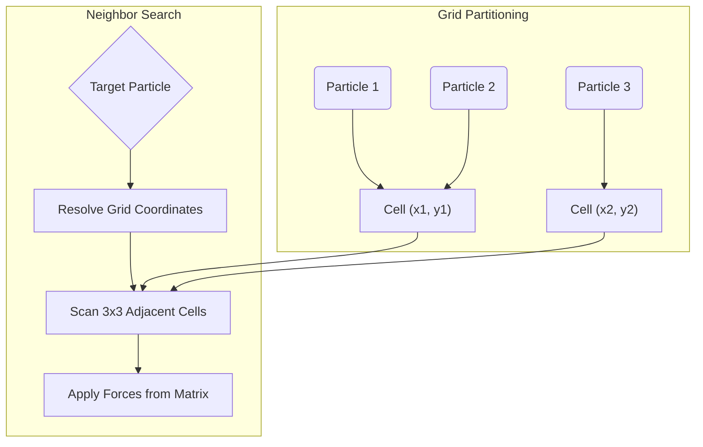

# 🐈 FartinCat

  

  

    <strong>A high-performance digital playground focused on system-level speed, absolute privacy, and elegant engineering.</strong>
  

  

    
    
    
  

---

## 👤 About FartinCat
I am an **independent systems architect and anonymous developer** driven by a passion for understanding how complex systems operate under the hood. My engineering philosophy is built on three core pillars:
1. **Performance First:** Minimize overhead, eliminate lag, and write code close to the metal.
2. **Absolute Privacy:** Build local-first architectures that operate without external telemetry or data leaks.
3. **Clean Abstractions:** Design reusable frameworks (like the `Aether Agent` ecosystem) that inject power into any workspace.

---

## 🛠 Unified Tech Stack

I select tools based on performance, type safety, and architectural elegance.

### 💻 Languages & Systems

  
  
  
  
  
  

### ⚙️ Core Libraries, Frameworks & Infrastructure
- **Agentic Architectures:** Aether Agent AOS Framework, MCP (Model Context Protocol), Tool Registry
- **LLM/Speech:** Llama 3.3 (via Groq), Whisper, edge-tts (neural synthesis), Local STT (Vosk/Whisper)
- **Web Technologies:** HTML5, Premium Vanilla CSS, Flask, SQLite, Tailwind CSS, Alpine.js
- **DevOps & Data:** Docker, PostgreSQL, Redis, MongoDB

---

## 📂 Active Portfolio Showcase

The digital playground is organized into three primary engineering domains:

### 🧠 Autonomous Systems & AI

This track focuses on advanced cognitive agents, local execution runtimes, and self-improving workflows.

| Project Name | Primary Stack | Scope / Core Highlights | Status |
| :--- | :--- | :--- | :--- |
| **🌌 Aether Agent OS** | `Python` `YAML` `MCP` | **The Ultimate Agentic Operating System.** Features a strict 5-Phase software engineering lifecycle, 23 specialist personas, and foundational cognitive loops. Released under the AAEL. | `🟢 v4.12.4` |
| **🤖 JARVIS Local Assistant** | `Rust` `Python` `PowerShell` | **Local-First Cyberpunk Voice Assistant.** Implements neural TTS, multi-engine STT, dynamic Windows/WSL app discovery, volume/brightness/hotspot controls, and a persistent memory database. | `🟢 v0.4.0` |

### 🔬 Systems & Scientific Simulations

Exploring physics, mathematical mechanics, and heavy graphics calculations through elegant code.

| Project Name | Primary Stack | Scope / Core Highlights | Status |
| :--- | :--- | :--- | :--- |
| **🌌 Particle Nexus** | `TypeScript` `Canvas 2D` | **Emergent Particle-Life Simulation.** 6×6 attraction/repulsion interaction matrix, O(n) cell-partitioned spatial grid neighbor indexing, friction dynamics, and interactive UI control panel. | `🟢 Active` |
| **🧬 Particle Accelerator** | `Python` `Math` | Simulation of electromagnetic particle behavior and trajectories in electromagnetic fields. | `🟡 Research` |
| **🎢 Brachistochrone Sim** | `JavaScript` `Physics` | Interactive physics simulation modeling the curve of fastest descent under uniform gravity. | `🟢 Complete` |

### 🌐 Premium Web Experiences

Combining highly expressive layouts, luxury typography, and full-stack interactivity.

| Project Name | Primary Stack | Scope / Core Highlights | Status |
| :--- | :--- | :--- | :--- |
| **💅 Vellora (Myraah Salon)** | `Flask` `SQLite` `Tailwind` | **Luxury Unisex Salon Booking Engine.** Full-stack system featuring beautiful bespoke pages, appointment reservation tables, franchise management, and loyalty scheme (Velvet Card). | `🟢 Complete` |
| **🍽️ NoirBistro (Nordic Bistro)** | `HTML5` `Vanilla CSS` `JS` | **Premium Culinary & Reservation Showcase.** An elegant dark-themed dining interface featuring interactive table booking, animated menu transitions, parallax gourmet photography, and subtle micro-animations. | `🟢 v1.0.0` |

### 🛠 Productivity & Utilities

| Project Name | Primary Stack | Scope / Core Highlights | Status |
| :--- | :--- | :--- | :--- |
| **🧮 Scientific Calculator** | `Web` `JS` | Compact web-based calculator supporting advanced trigonometric, algebraic, and memory functions. | `🟢 Complete` |

---

## ⚡ Engineering Deep Dive: The Emergent Spatial Grid

In the **Particle Nexus** simulation, standard O(n²) pair comparisons become a severe bottleneck beyond 100 particles. To keep the simulation running at a locked **60 FPS**, a custom **spatial partitioning grid** was designed to map particles into coordinate buckets:

*This cell partitioning model optimizes collision and attraction loops to **O(n)** time complexity, making real-time multi-color fluidics possible on standard CPUs.*

---

## 🛡 License
Projects under this playground are licensed under the MIT License unless stated otherwise. 
*Note: The **Aether Agent Ecosystem** is licensed under the proprietary **Aether Agent Ecosystem License (AAEL)**.*

---

  "Talk is cheap. Show me the code." — Linus Torvalds 
  Built with ❤️ by <strong>FartinCat</strong> • Contact: <strong>fartincat@proton.me</strong>

